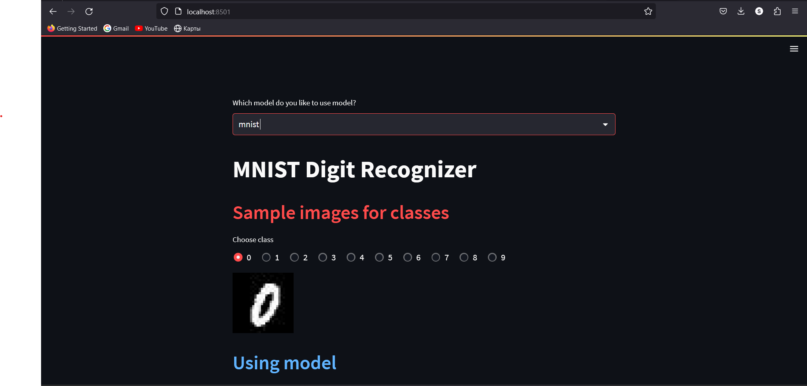
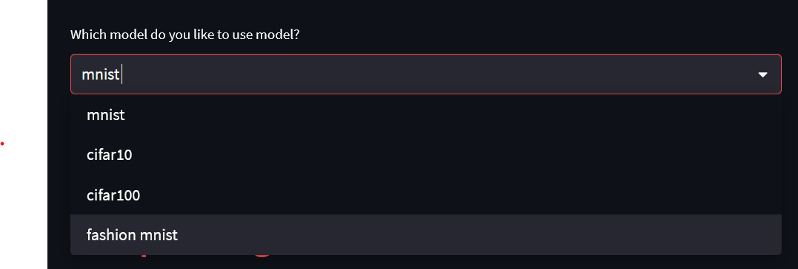

# Common 4 dataset in keras

This datasets are [mnist](http://yann.lecun.com/exdb/mnist/), [cifar10 and cifar100](https://www.cs.toronto.edu/~kriz/cifar.html) and [fashion mnist](https://www.kaggle.com/datasets/zalando-research/fashionmnist).

## <span style="color:red">About datasets</span>

### <span style="color:blue">Mnist</span>

The MNIST database of handwritten digits, available from this page, has a training set of 60,000 examples, and a test set of 10,000<br> examples. It is a subset of a larger set available from NIST. The digits have been size-normalized and centered in a fixed-size image<br>

### <span style="color:brown">Cifar10</span>

The CIFAR-10 dataset consists of 60000 32x32 colour images in 10 classes, with 6000 images per class. There are 50000 training<br> images and 10000 test images.

The dataset is divided into five training batches and one test batch, each with 10000 images. The test batch contains exactly 1000<br> randomly-selected images from each class. The training batches contain the remaining images in random order, but some training<br> batches may contain more images from one class than another. Between them, the training batches contain exactly 5000 images from<br> each class.

### <span style="color:green">Cifar100</span>

This dataset is just like the CIFAR-10, except it has 100 classes containing 600 images each. There are 500 training images<br>
and 100 testing images per class. The 100 classes in the CIFAR-100 are grouped into 20 superclasses. Each image comes with a<br>
"fine" label (the class to which it belongs) and a "coarse" label (the superclass to which it belongs).<br>
Here is the list of classes in the CIFAR-100:

### <span style="color:yellow">Fashion mnist</span>

Fashion-MNIST is a dataset of Zalando's article images—consisting of a training set of 60,000 examples and a test set of 10,000<br> examples. Each example is a 28x28 grayscale image, associated with a label from 10 classes. Zalando intends Fashion-MNIST to serve<br> as a direct drop-in replacement for the original MNIST dataset for benchmarking machine learning algorithms. It shares the same<br> image size and structure of training and testing splits.

### Usage of [Streamlit](https://github.com/streamlit/streamlit.git)

```
streamlit run stream.py
```

The result is as follows:

<a></a>

You can select the dataset you want to use by:

<a></a>

In mnist and fashion mnist datasets, we give you comfort in 2 different looks as follows:

<a></a>

## Features

### Deep Learning

- we have deep neural network with keras in [tensorflow](https://github.com/tensorflow/tensorflow.git)

## Installation

Install python and:

```
pip install -r requirements.txt
```
